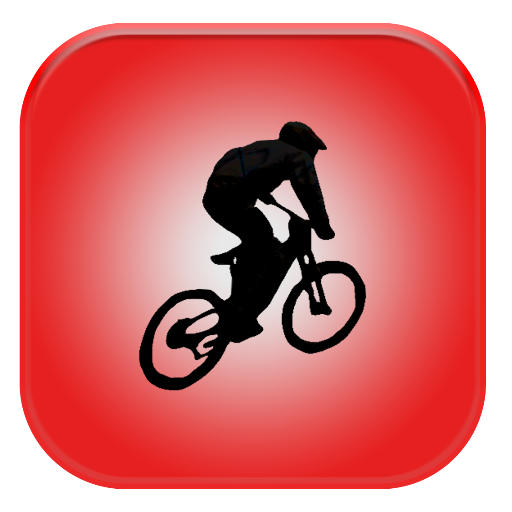

# RideSafeDataCollection
home of the data collection aspect of RideSafe

An application built to collect data such as speed, gforce and rotational velocity while a user is cycling.
Data was used to train the model used in "RideSafe MTB"   https://play.google.com/store/apps/details?id=com.release.nanou.ridesafe

app-debug.apk is all you need to get the app installed, download the file, copy to android device and install. 
Note-allowing apps from untrusted sources will need to be enabled (you will get a prompt)  All the code is here so a look in the main service class will show that only sensor data is collected.
